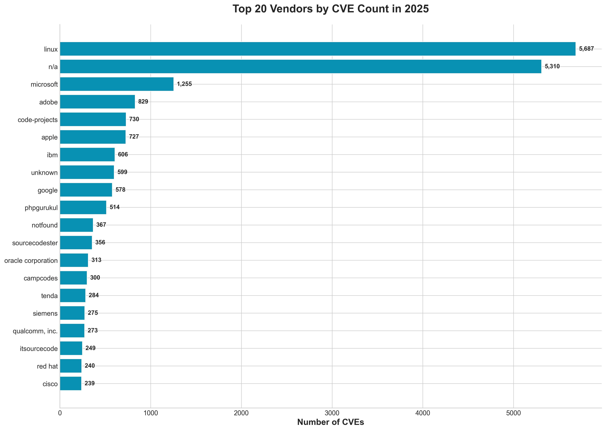
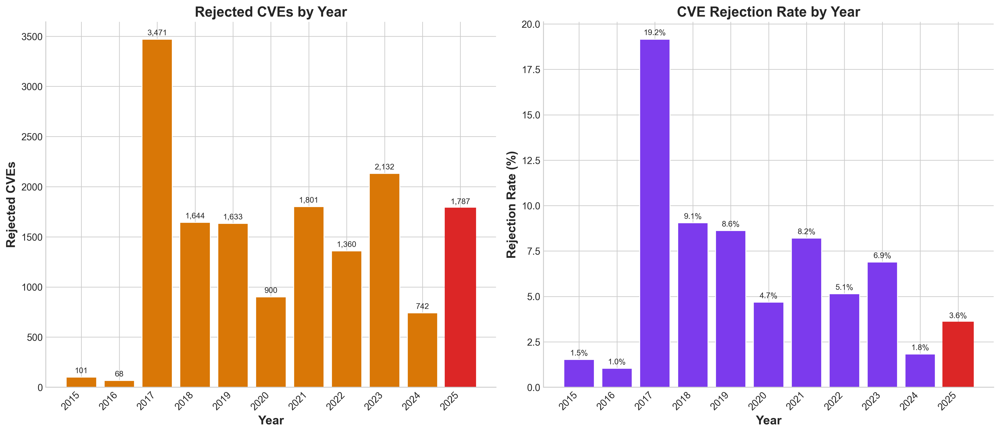

# 2025 CVE Data Review

*By Jerry Gamblin | December 31, 2025*

---

Another year has come and gone, bringing with it, yet again, a record-breaking number of CVE disclosures. In this annual review, I analyze the Common Vulnerabilities and Exposures (CVE) data for 2025, examining trends in vulnerability disclosures, severity distributions, and the organizations driving vulnerability documentation. Understanding these trends is crucial for prioritizing security efforts and allocating resources effectively. A CVE, for those unfamiliar, is a unique identifier assigned to a publicly known security vulnerability. Let's dive into the specifics of 2025.
## Executive Summary

**2025 saw 48,124 CVEs published**, an increase of **20.4%** compared to 39,962 CVEs in 2024. This surge underscores the escalating threat landscape and the relentless efforts of security researchers and malicious actors alike. This brings the all-time total to **308,859 CVEs** since the program began in 1999. This represents a significant accumulation of known vulnerabilities over the past quarter-century, highlighting the ongoing challenge of software security.

> **Note**: All statistics in this report exclude rejected CVEs to provide an accurate count of active vulnerabilities.

It's important to understand that a "rejected CVE" is one that was initially assigned but later deemed not to be a vulnerability or a duplicate of an existing CVE. By excluding these, we ensure a more accurate representation of the actual number of unique, exploitable weaknesses identified. The sheer volume of CVEs demands a proactive approach to vulnerability management, including robust scanning, patching, and threat intelligence gathering.
### Key Statistics at a Glance

| Metric | Value |
|--------|-------|
| **Total CVEs in 2025** | **48,124** |
| Year-over-Year Change | +20.4% |
| Critical Severity | 3,980 |
| High Severity | 14,978 |
| Average CVSS Score | 6.60 |
| CVSS Coverage | 91.3% |
| CWE Coverage | 92.3% |
| Active CNAs | 365 |
| Rejected CVEs (2025) | 1,787 |

---

## Historical CVE Growth

The number of CVEs published each year continues its upward trajectory, reflecting the ever-evolving threat landscape and increased scrutiny of software vulnerabilities. 2025 marks another year of significant growth in vulnerability disclosures, highlighting the ongoing need for proactive security measures.

The growth isn't uniform—some years saw dramatic increases while others showed modest growth or even slight declines. This variability can be attributed to factors such as the emergence of new attack vectors, increased security research efforts, or changes in reporting practices. The year-over-year growth rate provides a clearer picture of these fluctuations, allowing us to analyze trends more effectively.

Looking at the cumulative total, we've now surpassed **308,180 CVEs** in the database. This staggering number underscores the importance of vulnerability management and the continuous effort required to stay ahead of potential threats. Remember that a CVE, or Common Vulnerabilities and Exposures, is a standardized identifier for publicly known security flaws.

---
## 2025 Monthly Distribution

CVE publications saw fluctuations throughout 2025, reflecting the dynamic nature of vulnerability discovery and reporting. Notably, **Dec** emerged as the peak month, recording a substantial **5,439 CVEs**. This surge could be attributed to various factors, such as end-of-year security audits or the coordinated disclosure of vulnerabilities.

---

Analyzing monthly distributions like this helps us understand trends in vulnerability disclosures. By identifying peak periods, security teams can better allocate resources and proactively address potential risks. Further investigation into the specific vulnerabilities disclosed in December could reveal valuable insights into the types of systems and software most targeted during that period. Keep in mind that a CVE, or Common Vulnerabilities and Exposures, is a standardized identifier for publicly known security flaws.
## CVSS Score Analysis

The Common Vulnerability Scoring System (CVSS) is a crucial framework that helps standardize the severity assessments of vulnerabilities. By providing a numerical score, CVSS enables security professionals and organizations to prioritize remediation efforts effectively. Let's examine how the 2025 CVEs were distributed across the CVSS scoring range.

As you can see from the distribution, vulnerabilities span the entire spectrum of severity. The **average CVSS score for 2025 was 6.60**, with a **median of 6.50**. These values indicate that, on average, vulnerabilities reported in 2025 were of medium severity. The closeness of the average and median suggests a fairly symmetrical distribution, meaning there wasn't a disproportionate number of extremely high or low severity vulnerabilities skewing the results.
### Severity Breakdown

| Severity | Count | Percentage |
|----------|-------|------------|
| Critical | 3,980 | 8.3% |
| High | 14,978 | 31.1% |
| Medium | 25,517 | 53.0% |
| Low | 1,557 | 3.2% |

### CVSS Trends Over Time

Understanding the severity of vulnerabilities is paramount in cybersecurity. The Common Vulnerability Scoring System (CVSS) provides a standardized way to assess and communicate the characteristics and impact of software vulnerabilities. Let's examine how CVSS scores have trended over time.

---

Analyzing CVSS scores annually helps us understand the evolving risk landscape. By tracking these trends, organizations can better prioritize their vulnerability management efforts and allocate resources effectively to mitigate the most critical threats. This historical perspective is invaluable for proactive security planning.
## Top Weakness Types (CWE)

The Common Weakness Enumeration (CWE) is a community-developed list of common software and hardware security weaknesses. Think of it as a dictionary for describing the different kinds of flaws that can plague our systems. Understanding CWEs is crucial for developers and security professionals aiming to build more robust and secure applications. Here are the most prevalent weakness types observed in 2025:

As you can see in the graph, specific CWEs consistently top the list, indicating recurring patterns in software vulnerabilities. This highlights the importance of targeted training and preventative measures to address these common pitfalls. Analyzing the trends in CWE prevalence allows us to prioritize our security efforts and allocate resources effectively.
### Top 5 CWEs in 2025

| Rank | CWE | Name | Count |
|------|-----|------|-------|
| 1 | CWE-79 | Cross-site Scripting (XSS) | 8,183 |
| 2 | CWE-74 |  | 2,559 |
| 3 | CWE-862 | Missing Authorization | 2,215 |
| 4 | CWE-352 | Cross-Site Request Forgery | 1,893 |
| 5 | CWE-89 | SQL Injection | 1,704 |

---

## CVE Numbering Authorities (CNAs)

CVE Numbering Authorities (CNAs) are organizations authorized to assign CVE IDs. These IDs are crucial for tracking and managing vulnerabilities across different systems and software. The ecosystem continues to grow, reflecting the increasing importance of coordinated vulnerability disclosure and the collaborative effort to secure the digital landscape. This growth signals a stronger, more proactive approach to vulnerability management.

The visualization above shows the top CNAs by the number of CVEs assigned. Examining which organizations are most active in CVE assignment provides insight into where vulnerabilities are most frequently discovered and reported. It also highlights the commitment of these organizations to improving cybersecurity.
### Top 5 CNAs in 2025

| Rank | CNA | CVEs Assigned |
|------|-----|---------------|
| 1 | Patchstack | 7,007 |
| 2 | VulDB | 5,900 |
| 3 | Linux | 5,686 |
| 4 | mitre | 5,207 |
| 5 | Wordfence | 3,451 |

In total, **365 unique CNAs** assigned CVEs in 2025.

---

## Top Vendors

Which vendors bore the brunt of vulnerability discoveries in 2025, resulting in the most CVEs assigned to their products? Let's delve into the landscape of vendor vulnerabilities.

The graph above visually represents the vendors with the highest number of CVEs recorded against their products during the year. Understanding which vendors are most frequently targeted or have the most vulnerabilities discovered in their products is crucial for prioritizing security efforts and risk management. This information helps organizations make informed decisions about vendor selection, patching schedules, and overall security posture.
### Top 5 Vendors in 2025

| Rank | Vendor | CVE Count |
|------|--------|-----------|
| 1 | linux | 5,687 |
| 2 | n/a | 5,310 |
| 3 | microsoft | 1,255 |
| 4 | adobe | 829 |
| 5 | code-projects | 730 |

---

## Data Quality

Not all CVEs are created equal, and the completeness of their associated metadata can vary. The richness of this metadata is crucial for accurate vulnerability assessment and effective remediation. Let's examine how data quality, specifically the presence of key metadata elements within CVE records, has evolved over the years:

As the graph illustrates, the trend generally shows improvement in data quality. This progress reflects ongoing efforts by the CVE Numbering Authorities (CNAs) and the CVE Program to enhance the consistency and comprehensiveness of vulnerability data. By having more complete metadata, security professionals can better understand the context of a vulnerability, assess its potential impact, and prioritize remediation efforts accordingly. This is particularly important when dealing with high-severity vulnerabilities that could have significant consequences if exploited.
### 2025 Data Quality Metrics

| Metric | Coverage |
|--------|----------|
| CVSS Score | 91.3% |
| CWE Classification | 92.3% |
| CPE Identifiers | 57.5% |

---

## Rejected CVEs

Not all CVE IDs assigned make it into the final, validated list. Some are rejected due to various reasons, including duplicates, disputes, or simply invalid submissions. Understanding rejection patterns provides valuable insight into the CVE ecosystem's quality control mechanisms and the challenges in vulnerability identification.

The graph above illustrates the trend of rejected CVEs over time. Analyzing this data helps us understand the effectiveness of the CVE Numbering Authorities (CNAs) in filtering out inaccurate or redundant vulnerability reports, ensuring a higher degree of confidence in the published CVE records. This proactive rejection process helps maintain the integrity of vulnerability data, preventing confusion and wasted effort in security research and remediation.
### 2025 Rejection Statistics

Understanding the lifecycle of a CVE (Common Vulnerabilities and Exposures) entry includes recognizing that not all initially reported vulnerabilities are ultimately validated. A portion of CVEs are rejected for various reasons, and analyzing these rejections provides valuable insight into the vulnerability landscape. Let's examine the rejection statistics for 2025.

| Metric | Value |
|--------|-------|
| Rejected CVEs in 2025 | 1,787 |
| 2025 Rejection Rate | 3.58% |
| Total Rejected (All Time) | 15,639 |

These numbers highlight that a notable percentage of initially submitted CVEs don't make it through the validation process. The 3.58% rejection rate in 2025, in particular, warrants further examination to understand the contributing factors. CVE rejections occur for several reasons:

- **Duplicates**: The same vulnerability assigned multiple CVE IDs. This often happens when different researchers or organizations independently discover and report the same issue.
- **Disputes**: Vendor disagreement that the issue is a vulnerability. Sometimes vendors may not agree with the severity or impact of a reported issue, leading to a dispute and potential rejection.
- **Invalid**: Not a security vulnerability or insufficient information. Submissions might lack the necessary details or context to be properly assessed as a genuine vulnerability.
- **Withdrawn**: CVE withdrawn by the assigning CNA (CVE Numbering Authority). CNAs are responsible for assigning CVE IDs, and in some cases, they may withdraw a CVE if new information comes to light.

---
## Conclusions

In conclusion, understanding CVE (Common Vulnerabilities and Exposures) data is crucial for any organization striving to maintain a robust security posture. Let's recap some key takeaways from our exploration of this vital information source.

By actively monitoring and analyzing CVE data, organizations can proactively identify and address potential vulnerabilities before they can be exploited by malicious actors. This proactive approach is a cornerstone of effective risk management in the digital age. Remember that a CVE provides a standardized identifier for publicly known cybersecurity vulnerabilities.

The insights gleaned from CVE information empowers security teams to make informed decisions, prioritize remediation efforts, and ultimately strengthen their overall defenses against cyber threats. Continuous monitoring and analysis are essential components of a strong cybersecurity strategy.
### Key Takeaways from 2025

The year 2025 presented a complex landscape for cybersecurity professionals, marked by both escalating vulnerability disclosures and persistent data quality challenges. Let's delve into the key trends identified in the CVE data.

1. **Volume continues to grow**: With 48,124 CVEs, 2025 set a new record in vulnerability disclosures. This unprecedented number underscores the increasing complexity of modern software and the relentless efforts of researchers and adversaries alike. The sheer volume demands more efficient methods for vulnerability management and prioritization.

2. **Severity remains concerning**: 18,958 CVEs (39.4%) were rated Critical or High severity. This means a substantial portion of disclosed vulnerabilities pose an immediate and significant risk to systems and data. These high-severity vulnerabilities require swift action, including patching or implementing mitigating controls. The CVSS (Common Vulnerability Scoring System) is used to rate the severity of vulnerabilities.

3. **Common weaknesses persist**: Memory safety issues and web application vulnerabilities continue to dominate the top CWE list. This highlights the ongoing need for developers to prioritize secure coding practices and for organizations to implement robust web application firewalls (WAFs). CWE, or Common Weakness Enumeration, is a catalog of software weaknesses.

4. **Ecosystem expansion**: The growing number of CNAs reflects broader participation in coordinated vulnerability disclosure. CNAs, or CVE Numbering Authorities, are organizations authorized to assign CVE IDs to vulnerabilities. This collaborative approach is crucial for ensuring vulnerabilities are identified and addressed effectively.

5. **Data quality challenges**: While improving, a significant portion of CVEs still lack complete CVSS, CWE, or CPE data. This incomplete data hinders effective vulnerability assessment and prioritization. CPE, or Common Platform Enumeration, is a standardized method for describing and identifying software and hardware. Improving data completeness should be a priority for the community to enhance the utility of CVE data.

---
## Methodology

This analysis uses two primary data sources:

1. **NVD JSON** - National Vulnerability Database export from [nvd.handsonhacking.org](https://nvd.handsonhacking.org/nvd.json)
2. **CVE List V5** - Official CVE records from [GitHub CVEProject/cvelistV5](https://github.com/CVEProject/cvelistV5)

All graphs and statistics were generated using Python with pandas, matplotlib, and seaborn.

---

*Thank you for reading the 2025 CVE Data Review!*

*Data collected and analyzed on December 31, 2025.*

