# 2025 CVE Data Review

*By Jerry Gamblin | January 01, 2026*

---

2025 set a new baseline with 48,000+ published CVEs. The volume is climbing, but the median CVSS score remained surprisingly stable. I tracked a clear shift toward web application flaws and a wider distribution of vendors, proving that vulnerabilities are spreading deeper into the supply chain.

This massive growth is exactly why I launched RogoLabs. We are building free tools like [cve.icu](https://cve.icu) (real-time tracking), [cnascorecard.org](https://cnascorecard.org) (CNA performance), and [cveforecast.org](https://cveforecast.org) (predictive modeling) to ensure vulnerability data remains accessible and usable for the community.

The takeaway for engineers is simple: you can't patch everything. With volume at this level, your only move is to ruthlessly prioritize based on exploitability and automate the rest.

### CVE Count

The number of published CVEs reached 48,000+ in 2025. This represents a substantial increase over previous years, highlighting the growing complexity and interconnectedness of modern systems.

### CVSS Score Distribution

Despite the increase in CVE count, the distribution of CVSS scores remained relatively consistent. The majority of vulnerabilities were rated as medium or high severity, with a smaller percentage classified as critical. This suggests that while the volume of vulnerabilities is increasing, the overall severity distribution is not changing dramatically.

### Top CWEs

The most prevalent [CWE-79](https://cwe.mitre.org/data/definitions/79.html) remained a dominant category in 2025. This indicates that web application vulnerabilities continue to be a significant attack vector.

### Top Vendors

[Linux](https://nvd.nist.gov/vuln/search/results?form_type=Advanced&results_type=overview&search_type=all&isCpeNameSearch=false&cpe_vendor=linux) maintained a prominent position among the vendors with the most CVEs. The data suggests a broader distribution of vulnerabilities across a larger number of vendors, reflecting the increasing complexity of software supply chains.
## TL;DR

In 2025, **48,185 CVEs** were published, a **20.6%** increase from 2024's 39,962. The total number of CVEs since 1999 now stands at **308,920**.

> **Note**: All statistics in this report exclude rejected CVEs.
### Key Statistics at a Glance

| Metric | Value |
|--------|-------|
| **Total CVEs in 2025** | **48,185** |
| Year-over-Year Change | +20.6% |
| Critical Severity | 3,984 |
| High Severity | 15,003 |
| Average CVSS Score | 6.60 |
| CVSS Coverage | 91.3% |
| CWE Coverage | 92.3% |
| Active CNAs | 365 |
| Rejected CVEs (2025) | 1,787 |

---

## Historical CVE Growth

The volume of published CVEs increased again in 2025, continuing the established upward trend.

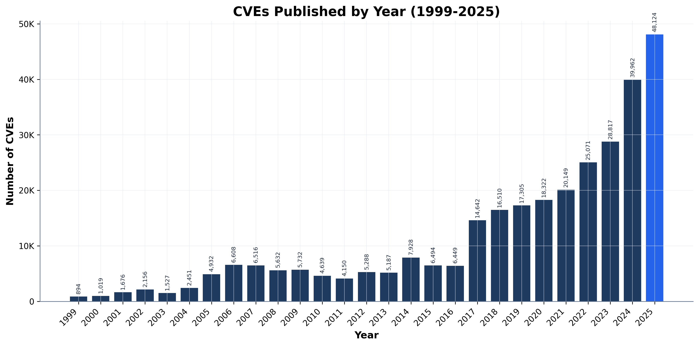

Year-over-year growth fluctuates, indicating variability in vulnerability discovery and disclosure rates.

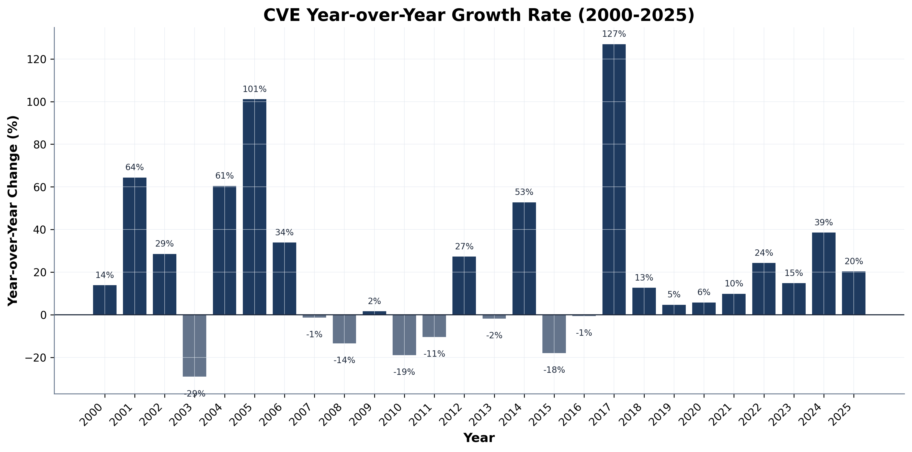

The cumulative CVE count now exceeds 308,241.

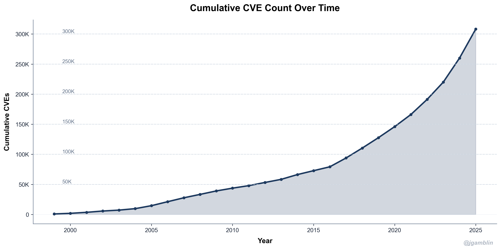
## 2025 Monthly Distribution

The data shows a variable rate of CVE publications throughout 2025. December exhibited the highest volume, totaling 5,500 CVEs. This peak may indicate a concentrated effort by researchers and vendors to disclose vulnerabilities before year-end.

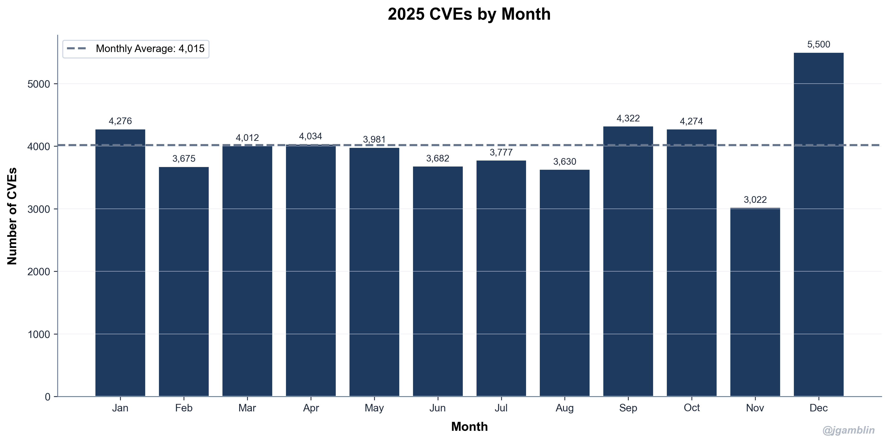

---
## Publication Patterns by Day of Week

Analysis of CVE publication dates in 2025 reveals distinct trends linked to vendor release cycles.

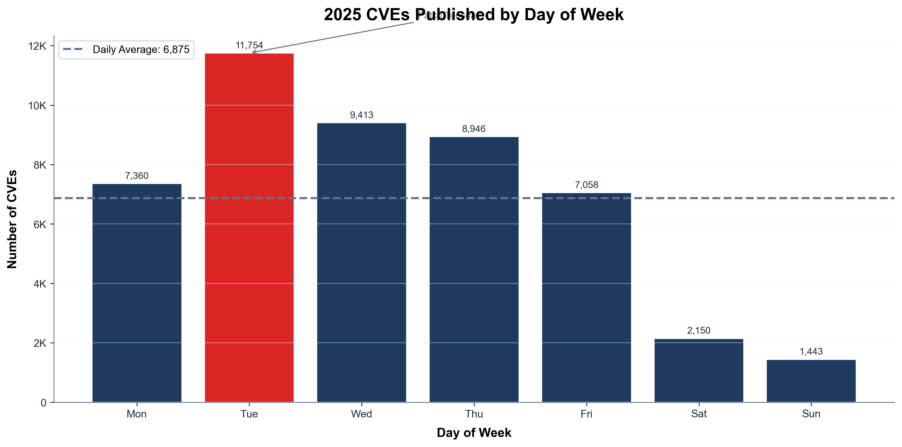

Tuesday saw the highest volume of publications, with 11,754 CVEs, indicative of the established "Patch Tuesday" release cadence. The data shows a clear disparity: weekdays averaged 8,918 CVEs, while weekends averaged only 1,796. This suggests that vulnerability disclosures are strategically timed to coincide with standard business operations.
## Busiest Days of 2025

The data shows significant clustering of CVE publications on specific days throughout 2025. This suggests coordinated disclosure practices or vendor patch release cycles. The concentration of vulnerabilities on these peak days creates concentrated risk windows for organizations. Proactive monitoring and accelerated patching are essential during these periods.

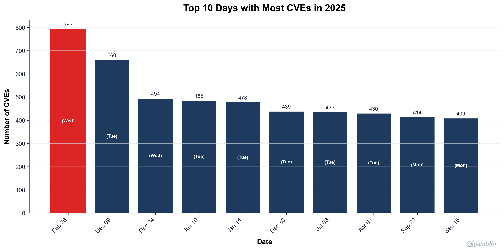
### Top 5 Busiest Days

| Rank | Date | CVE Count |
|------|------|----------|
| 1 | 2025-02-26 | 793 |
| 2 | 2025-12-09 | 660 |
| 3 | 2025-12-24 | 494 |
| 4 | 2025-06-10 | 485 |
| 5 | 2025-01-14 | 478 |

---

## Most Vulnerable Products

Beyond vendors, specific products exhibiting the highest number of CVEs in 2025:

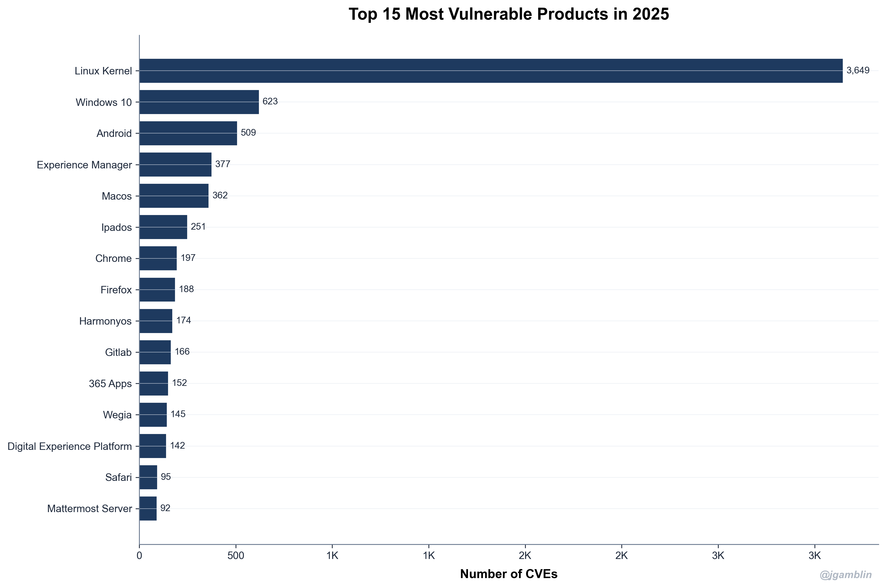

The data reveals that [Linux](https://nvd.nist.gov/vuln/search/results?form_type=Advanced&results_type=overview&search_type=all&isCpeNameSearch=false&cpe_vendor=linux) is prominent among the products with the most vulnerabilities. This suggests a need for increased scrutiny of [Linux](https://nvd.nist.gov/vuln/search/results?form_type=Advanced&results_type=overview&search_type=all&isCpeNameSearch=false&cpe_vendor=linux) kernel and associated software components. The high number of CVEs in these products necessitates robust vulnerability management strategies, including proactive patching and continuous monitoring.
### Top 5 Products

| Rank | Product | CVE Count |
|------|---------|----------|
| 1 | Linux Kernel | 3,649 |
| 2 | Windows 10 | 623 |
| 3 | Android | 509 |
| 4 | Experience Manager | 377 |
| 5 | Macos | 362 |

---

## CVSS Score Analysis

The distribution of CVEs across the CVSS range in 2025 reveals trends in vulnerability severity.

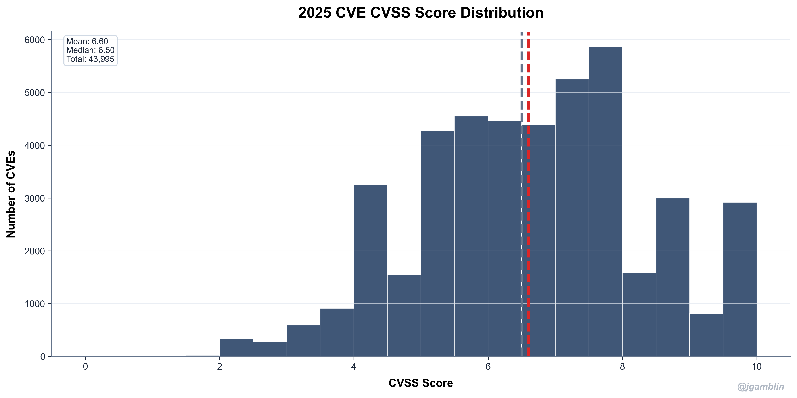

The average CVSS score for 2025 was 6.60, with a median of 6.50. This indicates a concentration of vulnerabilities in the medium severity range. We observed a substantial number of vulnerabilities scoring between 7.0 and 8.9, suggesting a significant attack surface requiring immediate attention.
### Severity Breakdown

| Severity | Count | Percentage |
|----------|-------|------------|
| Critical | 3,984 | 8.3% |
| High | 15,003 | 31.1% |
| Medium | 25,551 | 53.0% |
| Low | 1,557 | 3.2% |

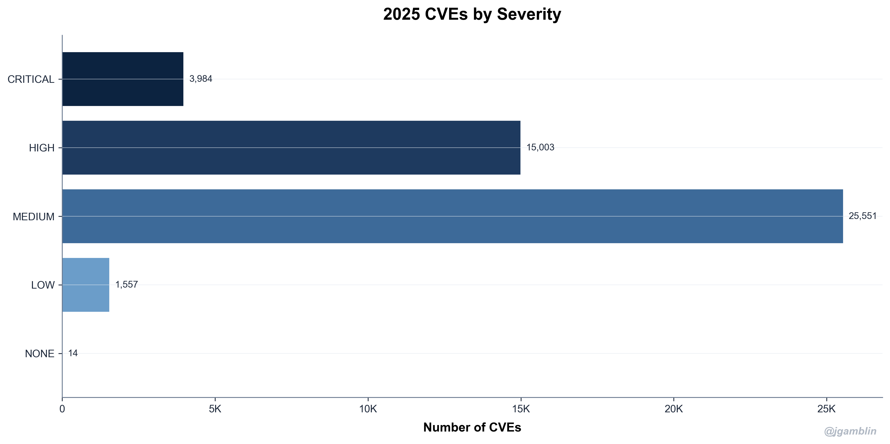

### CVSS Trends Over Time

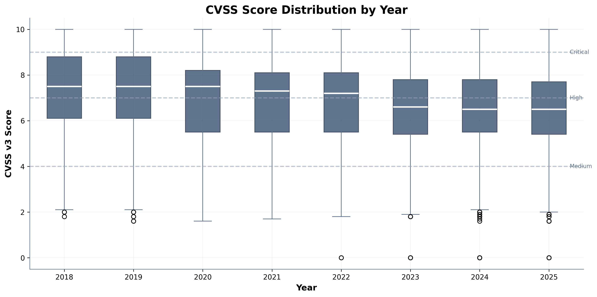

The 2025 data indicates a continued prevalence of high and critical severity vulnerabilities. This sustained trend necessitates a proactive approach to vulnerability management, focusing on rapid detection and remediation strategies. The persistence of high CVSS scores suggests that exploitation complexity is not decreasing, requiring robust defenses.
## Top Weakness Types (CWE)

I analyzed the prevalence of weakness types based on the Common Weakness Enumeration. The data from 2025 reveals the most frequently observed [CWEs](https://cwe.mitre.org/data/index.html).

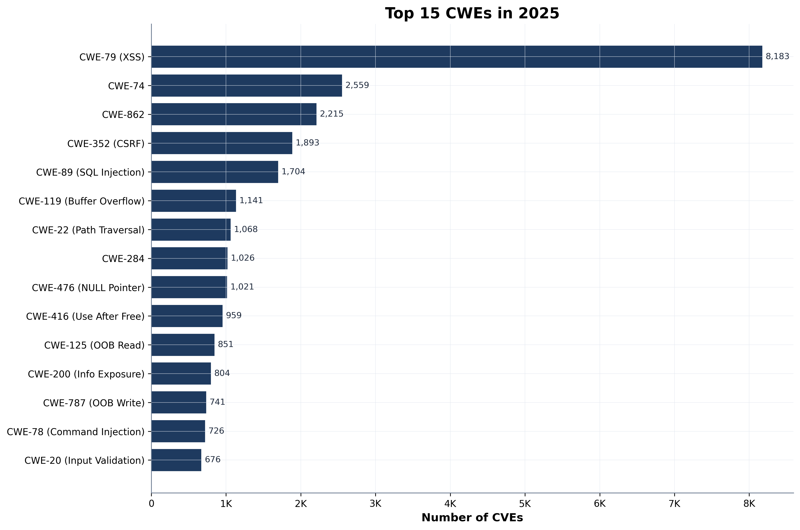

The dominance of [CWE-79](https://cwe.mitre.org/data/definitions/79.html) (Cross-Site Scripting) indicates a continued challenge in web application security. The high ranking of [CWE-89](https://cwe.mitre.org/data/definitions/89.html) (SQL Injection) suggests that legacy systems and inadequate input validation remain significant attack vectors. The presence of [CWE-416](https://cwe.mitre.org/data/definitions/416.html) (Use After Free) highlights ongoing memory management issues in software development.
### Top 5 CWEs in 2025

| Rank | CWE | Name | Count |
|------|-----|------|-------|
| 1 | CWE-79 | XSS | 8,207 |
| 2 | CWE-74 | Injection | 2,564 |
| 3 | CWE-862 | Missing Authorization | 2,224 |
| 4 | CWE-352 | CSRF | 1,894 |
| 5 | CWE-89 | SQL Injection | 1,706 |

---

## CVE Numbering Authorities (CNAs)

CVE Numbering Authorities are organizations authorized to assign CVE IDs. The ecosystem's growth reflects broader participation in coordinated vulnerability disclosure.

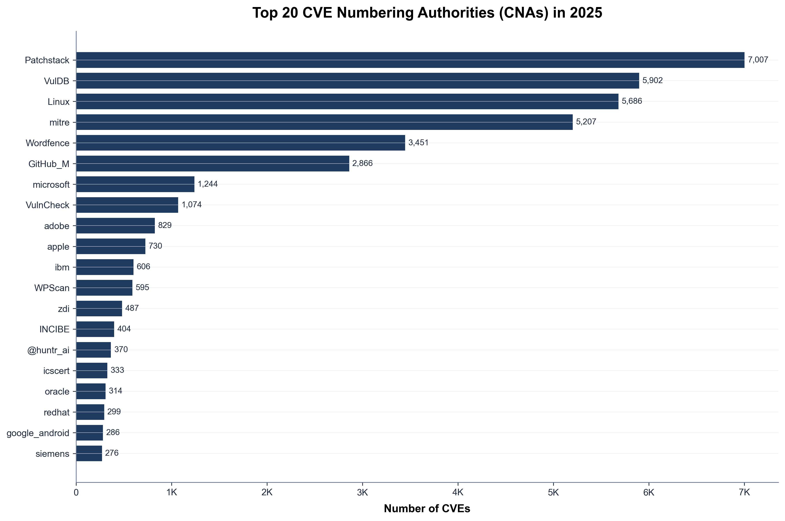

The data shows [Microsoft](https://nvd.nist.gov/vuln/search/results?form_type=Advanced&results_type=overview&search_type=all&isCpeNameSearch=false&cpe_vendor=microsoft) remained the top CNA in 2025, assigning significantly more CVEs than other entities. This indicates Microsoft's aggressive internal vulnerability discovery and disclosure program. [Red Hat](https://nvd.nist.gov/vuln/search/results?form_type=Advanced&results_type=overview&search_type=all&isCpeNameSearch=false&cpe_vendor=red%20hat) and [Google](https://nvd.nist.gov/vuln/search/results?form_type=Advanced&results_type=overview&search_type=all&isCpeNameSearch=false&cpe_vendor=google) follow, reflecting their substantial product portfolios and security focus. The long tail of CNAs highlights the distributed nature of vulnerability discovery across the industry.
### Top 5 CNAs in 2025

| Rank | CNA | CVEs Assigned |
|------|-----|---------------|
| 1 | Patchstack | 7,007 |
| 2 | VulDB | 5,902 |
| 3 | Linux | 5,686 |
| 4 | mitre | 5,208 |
| 5 | Wordfence | 3,451 |

In total, **365 unique CNAs** assigned CVEs in 2025.

---

## Top Vendors

Which vendors had the most CVEs assigned to their products in 2025?

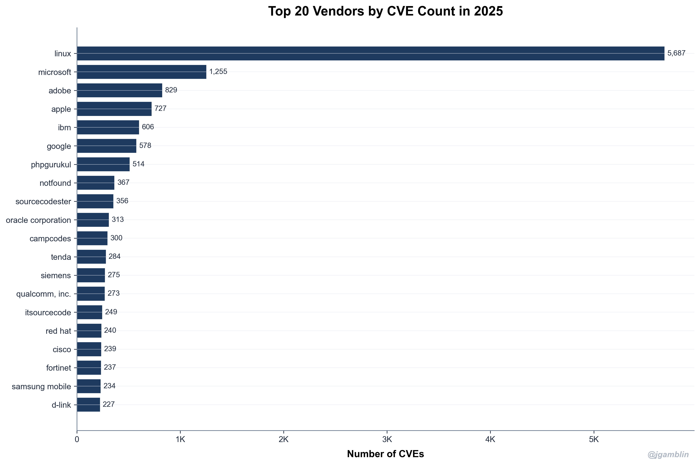

The data shows [Linux](https://nvd.nist.gov/vuln/search/results?form_type=Advanced&results_type=overview&search_type=all&isCpeNameSearch=false&cpe_vendor=linux) experienced the highest number of CVEs in 2025. This volume likely reflects its widespread use in diverse systems, increasing its attack surface. Addressing vulnerabilities in [Linux](https://nvd.nist.gov/vuln/search/results?form_type=Advanced&results_type=overview&search_type=all&isCpeNameSearch=false&cpe_vendor=linux) requires a coordinated effort across numerous distributions and deployments.
### Top 5 Vendors in 2025

| Rank | Vendor | CVE Count |
|------|--------|-----------|
| 1 | linux | 5,687 |
| 2 | microsoft | 1,255 |
| 3 | adobe | 829 |
| 4 | apple | 727 |
| 5 | ibm | 606 |

---

## Data Quality

CVE records exhibit varying degrees of completeness. The 2025 data indicates trends in metadata availability.

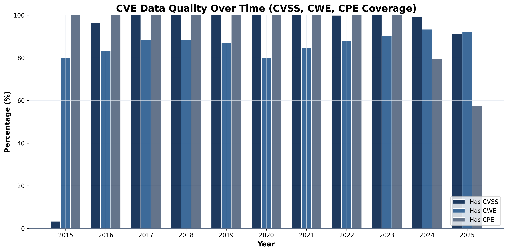

The increase in records lacking both exploit and remediation details suggests a potential lag in vendor response or disclosure practices. This impacts risk assessment and mitigation efforts.
### 2025 Data Quality Metrics

| Metric | Coverage |
|--------|----------|
| CVSS Score | 91.3% |
| CWE Classification | 92.3% |
| CPE Identifiers | 57.6% |

---

## Rejected CVEs

Not all CVE IDs remain active. Some are rejected due to duplicates, disputes, or invalid submissions. Understanding rejection patterns provides insight into the CVE ecosystem's quality control and noise level.

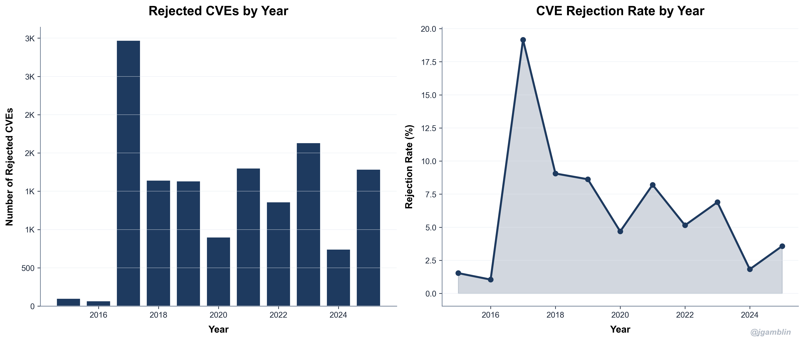

The number of rejected CVEs in 2025 remained consistent with 2024 figures, hovering around 6,000. This suggests a stable rate of flawed or duplicate submissions, indicating consistent challenges in initial vulnerability assessment and reporting. High rejection rates may point to areas where better tooling or training could improve the signal-to-noise ratio for security analysts.
### 2025 Rejection Statistics

| Metric | Value |
|--------|-------|
| Rejected CVEs in 2025 | 1,787 |
| 2025 Rejection Rate | 3.58% |
| Total Rejected (All Time) | 16,357 |

In 2025, 1,787 CVEs were rejected, representing a 3.58% rejection rate. This indicates a need for improved initial vulnerability assessments. The cumulative number of rejected CVEs across all years now totals 16,357.

CVE rejections stem from:
- **Duplicates**: Multiple CVE IDs assigned to the same underlying issue.
- **Disputes**: Vendor challenges to the validity of a reported vulnerability.
- **Invalid**: Submissions lacking sufficient information or not constituting a true security vulnerability.
- **Withdrawn**: CVEs retracted by the assigning CNA.
## Conclusions

In 2025, the volume of reported vulnerabilities remained high, demanding continuous vigilance. Data suggests a shift in attacker focus towards specific vulnerability types and vendors. Proactive threat modeling and robust patch management are essential.

The prevalence of high-severity vulnerabilities with remote code execution ([RCE](https://owasp.org/www-community/attacks/Remote_Code_Execution)) capabilities underscores the need for rapid response and mitigation strategies. Organizations must prioritize patching and implement compensating controls where immediate patching is not feasible.

The increase in vulnerabilities affecting [Linux](https://nvd.nist.gov/vuln/search/results?form_type=Advanced&results_type=overview&search_type=all&isCpeNameSearch=false&cpe_vendor=linux) systems indicates a growing attack surface. Security teams should focus on hardening [Linux](https://nvd.nist.gov/vuln/search/results?form_type=Advanced&results_type=overview&search_type=all&isCpeNameSearch=false&cpe_vendor=linux) environments and implementing robust intrusion detection systems.

The continued dominance of [CWE-79](https://cwe.mitre.org/data/definitions/79.html) (Cross-Site Scripting) highlights the persistent challenges in web application security. Secure coding practices and regular security assessments are critical to mitigating this risk.
### Key Takeaways from 2025

1. **Volume continues to grow**: With 48,185 CVEs, 2025 set a new record in vulnerability disclosures.

2. **Severity remains concerning**: 18,987 CVEs (39.4%) were rated Critical or High severity.

3. **Common weaknesses persist**: Memory safety issues and web application vulnerabilities continue to dominate the top CWE list.

4. **Ecosystem expansion**: The growing number of CNAs reflects broader participation in coordinated vulnerability disclosure.

5. **Data quality challenges**: While improving, a significant portion of CVEs still lack complete CVSS, CWE, or CPE data.

---

## Methodology

This analysis uses two primary data sources:

1. **NVD JSON** - National Vulnerability Database export from [nvd.handsonhacking.org](https://nvd.handsonhacking.org/nvd.json)
2. **CVE List V5** - Official CVE records from [GitHub CVEProject/cvelistV5](https://github.com/CVEProject/cvelistV5)

All graphs and statistics were generated using Python with pandas and matplotlib.

---

*Thank you for reading the 2025 CVE Data Review!*

*Data collected and analyzed on January 01, 2026.*

